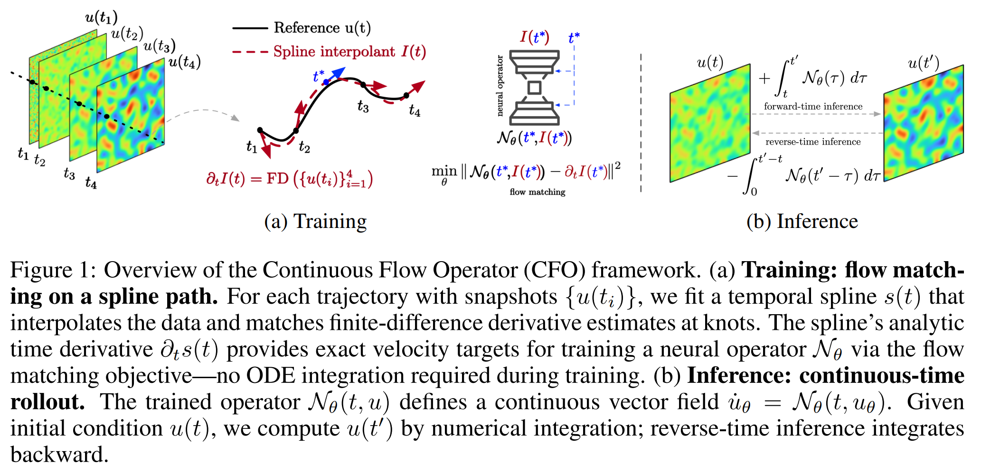

# Continuous Flow Operator (CFO)

Official implementation of **[CFO: Learning Continuous-Time PDE Dynamics via Flow-Matched Neural Operators](https://arxiv.org/abs/2512.05297)** (ICLR 2026).



## Paper Information

- **Title:** CFO: Learning Continuous-Time PDE Dynamics via Flow-Matched Neural Operators
- **Authors:** Xianglong Hou, Xinquan Huang, Paris Perdikaris
- **Affiliation:** University of Pennsylvania

## Installation

**Requirements:** Python >= 3.10, NVIDIA GPU with CUDA 12

```bash
conda create -n cfo python=3.10 -y
conda activate cfo
pip install -r requirements.txt
```

Verify GPU:

```bash
python -c "import jax; print(jax.devices())"
# Expected: [CudaDevice(id=0)]
```

**Optional settings:**

```bash
export CUDA_VISIBLE_DEVICES=0
export XLA_PYTHON_CLIENT_PREALLOCATE=false
```

## Data

Download datasets and place under `data/`:

| Dataset | Download | Path |
|---------|----------|------|
| Lorenz | [Drive](https://drive.google.com/drive/folders/1_3rucbf5qxApM3fQESDONi8N6KiNP2sS?usp=share_link) | `data/lorenz/` |
| Burgers | [Drive](https://drive.google.com/drive/folders/1tz0FQ8qqbLMxu_WPlAMHZmLMr2sBv2oE?usp=sharing) | `data/burgers/` |
| Diffusion-Reaction | [DaRUS](https://darus.uni-stuttgart.de/file.xhtml?fileId=133017&version=8.0) | `data/diffusion_reaction/` |
| Shallow Water | [DaRUS](https://darus.uni-stuttgart.de/file.xhtml?fileId=133021&version=8.0) | `data/shallow_water/` |

## Training

### Lorenz

```bash
# CFO
python scripts/train_cfo.py --dataset lorenz --model SimpleMLP --epochs 200000 --batch-size 2048 --lr 1e-4 --eval-interval 5000 --ckpt-prefix cfo_lorenz_mlp

# AR
python scripts/train_ar.py --dataset lorenz --model SimpleMLP --epochs 200000 --batch-size 2048 --lr 1e-4 --eval-interval 5000 --ckpt-prefix ar_lorenz_mlp
```

### Burgers

```bash
# CFO
python scripts/train_cfo.py --dataset burgers --model UNet1D --epochs 60000 --batch-size 256 --eval-interval 5000 --ckpt-prefix cfo_burgers_unet1d

# AR
python scripts/train_ar.py --dataset burgers --model SimpleMLP --epochs 60000 --batch-size 256 --eval-interval 5000 --ckpt-prefix ar_burgers_mlp
```

### Diffusion-Reaction

```bash
# CFO
python scripts/train_cfo.py --dataset dr --model UNet2D --epochs 5000 --batch-size 256 --lr 2e-4 --eval-interval 500 --ckpt-prefix cfo_dr_unet2d

# AR
python scripts/train_ar.py --dataset dr --model UNet2D --epochs 5000 --batch-size 256 --lr 2e-4 --eval-interval 500 --ckpt-prefix ar_dr_unet2d
```

### Shallow Water

```bash
# CFO
python scripts/train_cfo.py --dataset swe --model UNet2D --epochs 5000 --batch-size 256 --lr 1e-5 --eval-interval 500 --ckpt-prefix cfo_swe_unet2d

# AR
python scripts/train_ar.py --dataset swe --model DiT --epochs 5000 --batch-size 256 --lr 1e-5 --eval-interval 500 --ckpt-prefix ar_swe_dit
```

## Evaluation

### Download Checkpoints

Download pretrained checkpoints [here](https://drive.google.com/drive/folders/1SRrh-KH6eQ8D463VZBa7D1jJTOENrzyq?usp=share_link) and place under `checkpoints/`.

### CFO Evaluation

```bash
python scripts/evaluate_cfo.py --dataset lorenz --model SimpleMLP --ckpt-dir checkpoints --ckpt-prefix cfo_lorenz_mlp --split test --solver RK4 --steps-per-segment 2
python scripts/evaluate_cfo.py --dataset burgers --model UNet1D --ckpt-dir checkpoints --ckpt-prefix cfo_burgers_unet1d --split test --solver RK4 --steps-per-segment 2
python scripts/evaluate_cfo.py --dataset dr --model UNet2D --ckpt-dir checkpoints --ckpt-prefix cfo_dr_unet2d --split test --solver RK4 --steps-per-segment 2
python scripts/evaluate_cfo.py --dataset swe --model UNet2D --ckpt-dir checkpoints --ckpt-prefix cfo_swe_unet2d --split test --solver RK4 --steps-per-segment 2
```

### AR Evaluation

```bash
python scripts/evaluate_ar.py --dataset lorenz --model SimpleMLP --ckpt-dir checkpoints --ckpt-prefix ar_lorenz_mlp --split test
python scripts/evaluate_ar.py --dataset burgers --model SimpleMLP --ckpt-dir checkpoints --ckpt-prefix ar_burgers_mlp --split test
python scripts/evaluate_ar.py --dataset dr --model UNet2D --ckpt-dir checkpoints --ckpt-prefix ar_dr_unet2d --split test
python scripts/evaluate_ar.py --dataset swe --model DiT --ckpt-dir checkpoints --ckpt-prefix ar_swe_dit --split test
```

### Results

Relative L2 error on test set using the checkpoints:

| Dataset | CFO | AR |
|---------|-----|-----|
| Lorenz | **0.0356** | 0.0719 |
| Burgers | **0.0045** | 0.0421 |
| Diffusion-Reaction | **0.0498** | 0.6766 |
| Shallow Water | **0.0048** | 0.0920 |

## Repository Structure

```
├── cfo.py                 # CFO method implementation
├── autoregressive.py      # AR baseline implementation
├── train.py               # Training loops
├── scripts/
│   ├── train_cfo.py       # CFO training CLI
│   ├── train_ar.py        # AR training CLI
│   ├── evaluate_cfo.py    # CFO evaluation CLI
│   └── evaluate_ar.py     # AR evaluation CLI
├── models/                # Neural network architectures
├── utils/                 # Utilities (data, splines, etc.)
└── data/                  # Dataset directory
```

## Citation

```bibtex
@article{hou2025cfo,
  title={CFO: Learning Continuous-Time PDE Dynamics via Flow-Matched Neural Operators},
  author={Hou, Xianglong and Huang, Xinquan and Perdikaris, Paris},
  journal={arXiv preprint arXiv:2512.05297},
  year={2025}
}
```

## License

MIT License. See [LICENSE](LICENSE).
